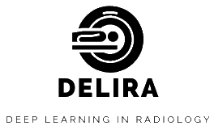

# Delira - Deep Learning in Radiology
Authors: [Justus Schock, Christoph Haarburger, Oliver Rippel](AUTHORS.rst)

## Introduction
Delira is deep learning framework for medical images such as CT or MRI. Based on [PyTorch](https://pytorch.org) and [batchgenerators](https://github.com/MIC-DKFZ/batchgenerators) it provides a framework for
* Dataset loading
* Dataset sampling
* Augmentation (multi-threaded) including 3D images with any number of channels
* A generic trainer class that implements the training process
* Web-based monitoring using [Visdom](https://github.com/facebookresearch/visdom)
* Model save and load functions

Delira supports classification and regression problems as well as generative adversarial networks.

## Installation
* `git clone -b v1.1 https://git.lfb.rwth-aachen.de/Radiology/Delira.git`
* `cd Delira`
* `pip install -r requirements_unix.txt`
* `pip install .`

## Getting Started
The best way to learn how to use is to have a look at the [Delira tutorial notebook](https://git.lfb.rwth-aachen.de/Radiology/Delira/blob/master/notebooks/Tutorial_Delira.ipynb).
Example implementations for classification problems and GANs are provided in the [examples](https://git.lfb.rwth-aachen.de/Radiology/Delira/tree/master/examples) folder.

## Contributing
If you find a bug or have an idea for an improvement, please have a look at our [contribution guideline](CONTRIBUTING.md).
